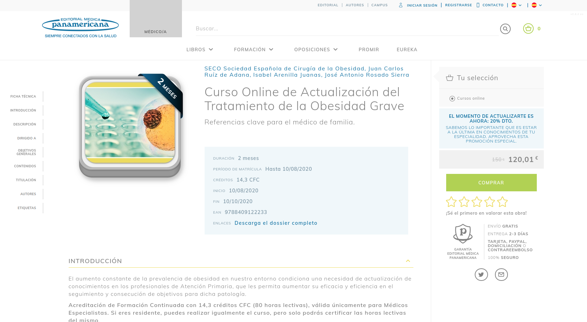
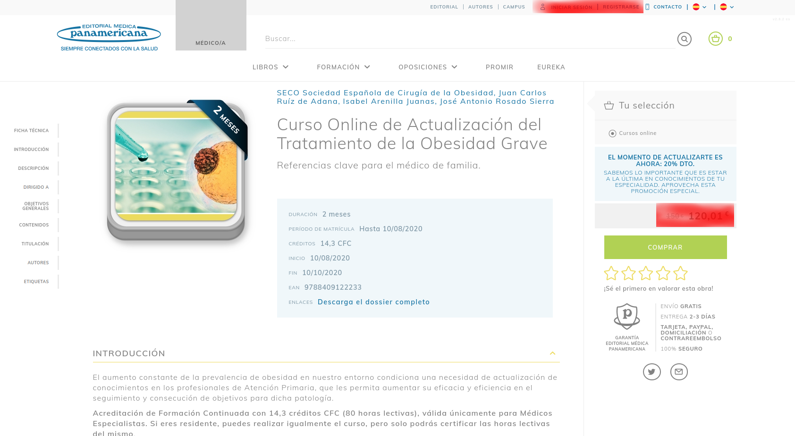

# Live Objects Lab

La tecnología de **Live Objects** forma parte del framework **A2R** y se encarga de gestionar la sincronización a tiempo real de la información almacenada en estructuras de datos que, en caso de ser modificadas en el servidor son actualizadas en todos los clientes que estén suscritos a dichas estructuras en tiempo real mediante la comunicación vía sockets.

Como concepto general, las modificaciones (o mutaciones) solamente se producirán en el lado servidor, teniendo que llamar vía API de A2R a un método para que realize la modificación y dicha actualización retorne al cliente por socket no debiendo modificar el objeto propiamente dicho de forma directa nunca.

## Modelo de comunicación de deltas

Siguiendo el estándar JSON-Patch propuesto por la [RFC6902](https://tools.ietf.org/html/rfc6902) y empleando el módulo **npm** [fast-json-patch](https://www.npmjs.com/package/fast-json-patch) por su rendimiento y alto nivel de adopción se genera una descripción de las modificaciones llevadas a cabo en una transacción dada:

```typescript
const document = { firstName: "Nacho", lastName: "Ferro", contactDetails: { phoneNumbers: [ { number:"607123456" }] } };
const observer = jsonpatch.observe(document);
document.firstName = "Ignacio";
document.contactDetails.phoneNumbers[0].number = "600123456";
document.contactDetails.phoneNumbers.push({ number:"913198888" });
const patch = jsonpatch.generate(observer);
```

Generaría un patch:

```typescript
[
 { op: "replace", path: "/firstName", value: "Ignacio"},
 { op: "replace", path: "/contactDetails/phoneNumbers/0/number", value: "600123456" },
 { op: "add", path: "/contactDetails/phoneNumbers/1", value: {number:"913198888"}}
]
```

Este modelo es especialmente interesante por el nivel de detalle que nos permite en las modificaciones de elementos de arrays, que en otros sistemas (como en el caso del protocolo **DDP** empleado por **Meteor**, suponen el remplazo completo del array).

En las pruebas de stress ha demostrado rendimientos muy superiores al resto de librerías similares, funcionando tanto en el lado servidor como cliente.

## Rendeo isomórfico

**A2R** adopta el nuevo estándar de [Data Fetching](https://nextjs.org/docs/basic-features/data-fetching) propuesto por [Next.JS](https://nextjs.org/) desde su versión 9.4.

Este nuevo modelo transforma el modelo de ciclo de generación de página.

Previamente se incorporaba al componente React de la página un método getInitialProps que podía ser ejecutada tanto en cliente como en servidor y que típicamente llamaba a un API (REST o GraphQL) para la carga de la información.

Este método ha sido remplazado por dos opciones distintas:

- **getStaticProps**: En el caso de páginas en las que la merezca la pena cachear la información porque no se modifica habitualmente
- **getServerSideProps**: En el caso de páginas en las que la información tenga que ser re-calculada en cada petición

Estas dos opciones, a diferencia de los modelos previos, solamente se ejecutan en el lado servidor y no se propagan a cliente (estando incorporadas en el fichero de la página pero exportándose por separado).

```typescript
// Interfaz de datos obtenido por la página
interface IndexProps {
  pokemonCards: PokemonCard[];
}

// Componente de la página
const Index = ({ pokemonCards }: IndexProps): JSX.Element => {
  return (
    <React.Fragment>
      {pokemonCards.map((card) => (
        <Card key={card.id} pokemonCard={card} />
      ))}
    </React.Fragment>
  );
};

// Obtención de propiedades de la página
// ejecutada solo en el lado servidor
export const getStaticProps: GetStaticProps<IndexProps> = async () => {
  const pokemonCards = await getPokemonCards();
  return {
    props: {
      pokemonCards,
    },
  };
};

export default Index;
```

La información proporcionada por el método generará la versión en lado servidor de la página con el JSON incorporado en la misma para hidratar la caché al inicio, pero en caso de navegación en lado cliente:

1. Realizará una llamada a un API generado automáticamente para obtener la información, bien de un fichero JSON pre-generado y cacheable, o bien ejecutando el método.
2. Obtendrá el bundle de pintado de la página si no lo tiene previamente disponible
3. Esperará a tener dicha información (evitando el doble rendeo como hasta ahora)
4. Rendeará la página en el lado cliente

Este nuevo flujo es igual (aplicando algunas mejoras) a lo que desde un inicio quisimos implementar en el sistema de rutas de A2R, por lo que lo adoptaremos directamente, no solo por la buena implementación actual, sino por la evolución que esperamos del mismo mediante paquetes de la comunidad.

> Por ejemplo, en la actualidad hay varios proyectos de generación automatizada de sitemaps basados en [getStaticPaths](https://nextjs.org/docs/basic-features/data-fetching#getstaticpaths-static-generation) (el método que nos permite predefinir los parámetros de todas las rutas posibles para una página para poder generar una versión cacheada  de las mismas).

### Concepción del rendeo en 2 pasos

Especialmente en el caso de usar **getStaticProps** para permitir el cacheo de la información pero también cuando empleemos **getServerSideProps** para contenidos que se actualizan con frecuencia, intentaremos en la medida de lo posible concebir el ciclo de vida de la página de la siguiente manera:

1. La versión información proporcionada por **getStaticProps** o **getServerSideProps** será la de la página universal, válida para todos los usuarios, que denominaremos **"user agnostic"**
2. Una vez cargada, y en el lado cliente dispondrá de la identidad del usuario y resto de información especifica de la sesión mediante el hook **useA2RContext** y aplicará las modificaciones correspondientes

> **Nota sobre useA2RContext**: Este Hook retornará `null` en el lado servidor y la información de contexto del socket en el lado cliente una vez conectado pero siempre esperará un ciclo de rendeo trás el primer **SSR** para evitar errores de consolidación. En el rendeo cliente siempre estará disponible.

Para ilustrar esto pongamos como ejemplo una página de la web de EMP:



Si nos fijamos, de los miles de nodos que componen el HTML de un producto de EMP (y por tanto componentes React), todos menos 2 contienen información **User Agnostic**.

Además esta versión **User Agnostic** es la que queremos explícitamente que se emplee en el rendeo de servidor, dado que una de sus utilidades (al margen de la velocidad de impresión de primera página) es el indexado de la misma.

Esto permitiría que todas las consultas y operaciones a realizar para el pintado de la misma estuvieran cacheadas y fueran una función pura no dependiente del usuario a excepción de:

- El link de iniciar sesión de la cabecera
- El precio (que casi siempre será común, pero puede variar para un usuario)

De este modo, los dos elementos marcados en rojo se actualizarían nada más cargar la página:



> Nota sobre redirecciones: En la actualidad hay un debate abierto que se resolverá en la próxima versión sobre la forma correcta de realizar redirecciones  y códigos de error: [Return redirect from getServerSideProps](https://github.com/vercel/next.js/discussions/11281). El método actual (modificar el status code de res) funciona en el SSR pero se está buscando una implementación 100% isomórfica.

### Versión pre-cacheada y actualizada

El uso de **Live Objects** es posible tanto en la información obtenida en el lado cliente a lo largo del ciclo de vida de la página como en los datos obtenidos del servidor (tanto mediante **getStaticProps** o **getServerSideProps**).

Esto permite que (especialmente en el caso de getStaticProps), podamos obtener una versión cacheada del objeto (por ejemplo la página del producto) y, en caso de haber sido modificada desde la última vez que se cacheó, un patch posterior sobre su modificación.

## Definir un live object

Un live object siempre implementará este interface:

```typescript
/**
 * Interface used by all Live Objects
 */
export interface LiveObject {
  // _lo stores all the information about the LiveObject
  _lo: {
    // Live Object Type Name (similar to collection)
    type: string;
    // Unique ID of the live object
    id: string;
    // Auto incremental version number
    v: number;
    // Number of subscriptions (only in client Side)
    n?: number;
  };
}
```

De hecho, tanto en las llamadas al API desde cliente como al cargar una página el framework recorrerá los nodos retornados para buscar una propiedad ``_lo`` que le permita identificar Live Objects para suscribirse a ellos.

### Ejemplo de uso de live objects

En la carpeta `server/model` crearemos un tipo para el objeto que queremos crear, dado que dicho tipo será tanto para el server como para el cliente:

```typescript
export interface Document extends LiveObject {
  title: string;
  subtitle: string;
}
```

En la carpeta `server/liveObjects` crearemos un la definición de nuestro LiveObject (que informará sobre como inicializarlo y guardarlo).

Para esto implementaremos el siguiente interface:

```typescript
/**
 * Interface used to define a Live Object Collection
 */
export interface LiveCollection<T extends LiveObject>  {
  /**
   * Unique name of the collection
   */
  type: string;
  /**
   * Function that will be used to restore a LiveObject
   * (typically from database)   
  * @param id {string} unique identifier of the document
  * @returns restored document or null in case it do not exists
  */
  loadLiveObject: (id: string) => Promise<T>;
  /**
   * Function that will be used to save LiveObject
   * (typically to database)   
  * @param obj {T} Document to save
  */
  saveLiveObject: (obj: T) => Promise<void>;
  /**
   * Function that will be used to delete a LiveObject
   * (typically in the database)   
  * @param id {string} unique identifier of the document
  */
  deleteLiveObject: (id: string) => Promise<void>;
}
```

De la siguiente manera:

```typescript
const collection = db.collection('documents');

const DocumentDefinition: LiveObjectDefinition<Document> = {
  type: 'Document',
  loadLiveObject: async (id) => {
    return await collection.findOne({_id: id},{ projection: { '__lo': 1, title: 1, subtitle: 1}}) as Document;
  },
  saveLiveObject: async (obj) => {
    await collection.updateOne(
      { _id: obj._lo.id },
      { $set: { ...obj } },
      { upsert: true }
    );
  },
  deleteLiveObject: async (id) => {
    await collection.deleteOne({_id: id});
  },
}

export default DocumentDefinition;
```

En este ejemplo implementamos una relación directa de un Live Object a un documento de mongo, pero podría ser un listado, una llamada a un API Rest, almacenamiento en ficheros, o cualquier otra implementación.

## El hook useLiveObjects

En el caso de una página, podremos usar el *hook* **useLiveObjects** para identificar **Live Objects** en las propiedades de nuestra página y suscribirnos a los mismos:

```typescript
// Interfaz de datos obtenido por la página
interface IndexProps {
  pokemonCards: PokemonCardsLiveObject;
}

// Componente de la página
const Index = (props: IndexProps): JSX.Element => {
  useLiveObjects(props);
  return (
    <React.Fragment>
      {props.pokemonCards.list.map((card) => (
        <Card key={card.id} pokemonCard={card} />
      ))}
    </React.Fragment>
  );
};

// Obtención de propiedades de la página
// ejecutada solo en el lado servidor
export const getStaticProps: GetStaticProps<IndexProps> = async () => {
  // En este caso la lista de PokemonCards sería un LiveObject
  const pokemonCards = await getPokemonCards();
  return {
    props: {
      pokemonCards,
    },
  };
};

export default Index;
```

El `hook` **useLiveObjects** tiene el siguiente ciclo de vida:

- Espera a que el socket esté conectado
- Recorre la recursivamente las propiedades obtenidas como parámetro buscando live objects
- Se suscribe a todos ellos: como parte de este proceso indica la versión actual de los objetos no solo suscribiéndose a cambios sino además obteniendo el patch para actualizar a la versión actual en caso de no estar actualizado
- En caso de tener una versión más reciente en la caché local, los actualiza (en caso de una navegación cliente, el primer rendéo de un objeto cacheado ya aparecería con la versión actualizada)
- En caso de modificarse cualquiera de los live objects, la página se re-rendeará
- Al desmontarse se marcará para desuscribirse, pero no lo hará hasta un tiempo después (para evitar que si tienen suscripciones en común entre páginas se produzca una desuscripción y suscripción posterior en el servidor)

> **Nota:** Es importante tener el cuenta que cada vez que nos suscribimos a un LiveObject, incrementamos la variable del Nº de suscripciones en el cliente, y al desuscribirnos la decrementamos. Solamente cuanto es zero nos desuscribimos realmente en el lado servidor.

Lo mismo podremos hacer con objetos obtenidos mediante nuestro API en lado cliente:

```typescript
interface CardProps {
  id: string;
}

const Card = ({ id }: CardProps): JSX.Element => {
  // Obtención de la información de un pokemon vía API de A2R
  const pokemon = await API.getPokemon(id);
  // Suscripción a cambios en la info de dicho pokemon
  useLiveObjects(pokemon);
  return (
    <div className="card">
      <span className="card--id">{`#${pokemonCard.id}`}</span>
      
      <h2 className="card--name">{pokemonCard.name}</h2>
      {
        pokemonCard.types.map((type) => (
          <span key={type} className="card--details">{type}</span>
        ))
      }
    </div>
  );
};

export default Card;
```

## Obtención de un Live Object en el lado servidor

En el ejemplo anterior, el método getPokemon tendría la siguiente implementación (en el fichero `server/api/getPokemon`):

```typescript
const getPokemon = async (id: string): Promise<PokemonCard> => {
  return getLiveObject<PokemonCard>('PokemonCard', id);
}

export default;
```

Dónde `PokemonCard` es el tipo retornado por el LiveObject, `'PokemonCard'` es el nombre de la colección (o tipo) de live objects y `id` el identificador del objeto.

